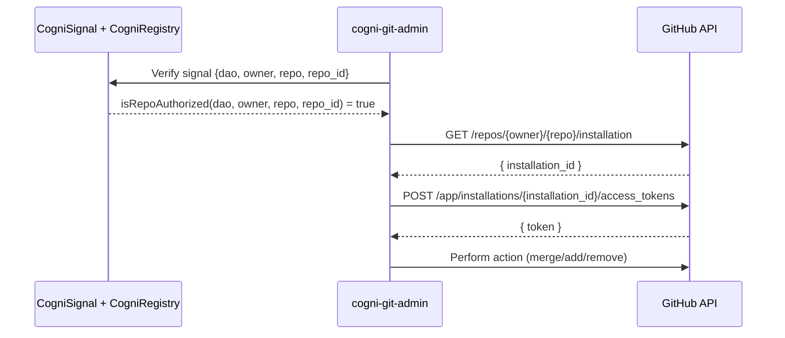

# Cogni Registry Roadmap

## Problem Statement

We need a secure, verifiable mapping of DAO ” GitHub repo to gate Cogni actions. Today, cogni-git-admin can obtain tokens for any repo where it is installed. We must harden the path:

```
CogniSignal (on-chain) ’ Verify DAO is authorized for {owner, repo, repo_id} ’ Resolve installation ’ Create installation token ’ Execute action (merge_pr | add_admin | remove_admin)
```

### Constraints
- No DB in v0
- Installation IDs are ephemeral on reinstall  
- Authorization must be durable and auditable

### Non-goals
- Storing GitHub installation IDs on-chain
- Custody of DAO keys by the GitHub App

## Design Overview

**On-chain = Authorization.**  
Store immutable repo coordinates and who may add/remove them.

**Off-chain = Resolution + Execution.**  
Resolve current installation, mint token, call GitHub APIs.



## Contract Surfaces (minimal)

```solidity
struct RepoRef {
    string provider;   // "github"
    string appSlug;    // "cogni-git-admin"
    string owner;      // "OrgOrUser"
    string repo;       // "repo-name"
    uint256 repoId;    // numeric GitHub repo ID
    bool active;
}

mapping(address => address) public authorizer; // dao -> authorizer (Safe/EOA)

function setAuthorizer(address dao, address auth) external;
function addRepo(address dao, RepoRef calldata ref) external;
function removeRepo(address dao, string calldata owner, string calldata repo) external;
function isRepoAuthorized(
    address dao, string calldata provider, string calldata appSlug,
    string calldata owner, string calldata repo, uint256 repoId
) external view returns (bool);
```

## v0  MVP (ship now)

**Principle:** No DB. App never signs chain tx. A temporary Registrar EOA you control writes to CogniRegistry.

### Flow

1. **Install event** ’ Probot receives `installation.created` with `{owner, repo, repo_id}`

2. **Registrar job** (script or manual Foundry task):
   - If first time for dao: `setAuthorizer(dao, registrarEOA)`
   - `addRepo(dao, { "github", "cogni-git-admin", owner, repo, repo_id, true })`

3. **Signal handling** (runtime):
   - Verify `isRepoAuthorized(...)`
   - `GET /repos/{owner}/{repo}/installation` ’ `POST /app/installations/{id}/access_tokens`
   - Execute `merge_pr | add_admin | remove_admin`

### Artifacts
- `CogniRegistry.sol` deployed alongside existing `CogniSignal`
- `scripts/seed.ts` or Foundry `script/AddRepo.s.sol` to write `addRepo`
- Probot handler for `installation.created` that emits machine-readable JSON for the Registrar

### Error Model
- `403 not_authorized_for_repo` when registry check fails
- `409 repo_installation_missing` when GitHub returns 404 for installation
- `409 repo_installation_mismatch` if owner/repo in signal ` resolved installation target

### Security Notes
- Registrar only adds repos in response to GitHub install events
- Rotate Registrar key on cadence; keep on testnet for dev
- Never store `installation_id` on-chain

### Checklist
- [ ] Deploy `CogniRegistry`
- [ ] Wire Probot `installation.created` ’ emit JSON payload
- [ ] Implement Registrar script (Foundry/Node) to call `addRepo`
- [ ] Gate all `CogniSignal` handling with `isRepoAuthorized(...)`
- [ ] Add metrics and structured logs for each gate

## v2  Delegate + Meta-Tx (user-friendly, no custody)

**Goal:** Remove Registrar custody and enable one-click writes without users funding gas.

### Changes
- Add `addRepoBySig(dao, ref, sig)` (EIP-712)
- The DAO signer signs off-chain; a public relayer sends the tx
- Introduce per-DAO `authorizer[dao] = Safe` (or Governor)
- Initial set via a guided flow or script
- App remains read-only on-chain. Relayer has no special rights

### Flow Delta
1. Web or CLI prepares `RepoRef` and EIP-712 digest
2. User signs with wallet
3. Relayer submits `addRepoBySig`
4. App listens for `RepoAuthorized` and proceeds as v0

### Benefits
- No EOA custody
- Gas abstracted from end user
- Auditable signatures

## v5  Full Web Onboarding (one-click "Start a DAO")

**Goal:** Seamless UX from zero to governed repo.

### Additions
**Web flow:**
1. GitHub OAuth ’ confirm `{owner, repo}`
2. SIWE ’ bind user to EVM address
3. Deploy Safe/Governor for `dao`
4. `setAuthorizer(dao, safeAddress)`
5. `addRepoBySig` via relayer
6. Guide to install `cogni-git-admin`

### Operations
- Per-chain `REGISTRY_ADDRESS` config
- Optional audit feed (events mirrored to a governance repo)
- Provider-agnostic schema: reserve provider union for Solana, etc.

## API References (runtime resolution)

- **Resolve installation:** `GET /repos/{owner}/{repo}/installation`
- **Access token:** `POST /app/installations/{installation_id}/access_tokens`

## Threat Model Summary

- **Forged signals:** mitigated by verifying emitter contract + chainId
- **Scope creep:** mitigated by registry check on `{owner, repo, repo_id}`
- **Reinstall churn:** unaffected; resolution is dynamic at execution time
- **Key custody:** avoided; app never holds DAO keys in any version

## Roadmap Summary

| Phase | Who writes registry | User keys needed | Gas | App keys on-chain | UX |
|-------|-------------------|------------------|-----|------------------|-----|
| v0 | Registrar EOA (yours) | None | Registrar | None | Basic, manual approve |
| v2 | DAO signer via EIP-712 + relayer | Wallet signature | Relayer | None | Simple, no gas from user |
| v5 | Safe/Governor via web flow | Wallet, guided | Relayer | None | One-click DAO + repo link |

This plan secures authorization today and cleanly upgrades to a fully self-serve, decentralized onboarding later.